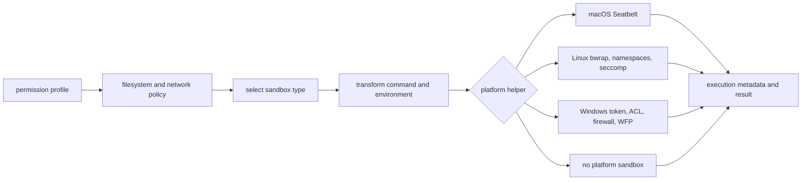

# 第 13 章：Sandboxes、网络策略与平台边界

第 12 章描述了决定副作用能否继续的关卡。本章跟随一个已获批准的动作进入隔离层。Approval 说明谁授权了这次 attempt；sandboxing 说明这次 attempt 仍然能触碰什么。它们是不同控制，Codex 也刻意让它们保持不同。

Sandbox 架构有三个阶段。第一，Codex 把 permission profile 解析成 filesystem policy 和 network policy。第二，sandbox manager 判断当前工具是否需要 platform sandbox，并在需要时改写 command。第三，platform helper 按该操作系统能表达的方式执行改写后的 command。

## Policy、Transform、Enforcement



这不是一个 sandbox，而是一个 policy compiler 加多个 enforcement backends。Compiler 是跨平台的；enforcement 是平台相关的。因此，同一个 permission profile 在不同操作系统上可能产生不同 command、warning 或 refusal。

## Permission Profile 是现代单位

旧配置直接使用 sandbox modes。现代 Codex 把 permission profiles 作为主单位。Profile 可以描述 filesystem access、network behavior、additional granted permissions，以及一个 turn 或 session 内的 active modifications。Runtime 再把 profile 投影成 filesystem sandbox policy 和 network sandbox policy。

Additional permissions 会在 enforcement 前合并。工具可以请求某个可写 root 或 network access。实际 granted subset 会先与请求求交，再并入 effective profile。这样权限授予是有范围的：批准一个请求，不会悄悄把整个 session 变成 unrestricted execution。

```text
// Pseudocode - simplified for clarity.
  base_profile = resolved_permissions_for_turn()
  granted = merge_session_and_turn_grants()
  effective_profile = apply_additional_permissions(base_profile, granted)

  filesystem_policy, network_policy = split_profile(effective_profile)

  sandbox_type = select_platform_sandbox(
      filesystem_policy,
      network_policy,
      tool_preference,
      managed_network_enabled
  )

  transformed = transform_command_for_platform(
      command,
      sandbox_type,
      effective_profile,
      network_proxy_state
  )

  execute(transformed)
```

关键点是 transform 接收 policy，而不是通过检查 command string 重新发现权限。

## macOS：生成 Seatbelt Profile

在 macOS 上，Codex 会把 policy 降低成 Seatbelt profile，并通过固定的平台 sandbox runner 执行。生成的 profile 表达 readable roots、writable roots、protected metadata、denied read patterns、allowed sockets 和 network proxy allowances。Sandbox runner path 不通过用户 shell 的 `PATH` 查找；它是平台边界，不是便利命令。

Seatbelt 很适合表达文件访问和部分 socket allow rules，但 runtime 仍要仔细准备 policy。Path normalization、protected subpaths、missing paths 和 proxy sockets 都在 helper 运行前解析好。如果 transform 不能在平台上忠实表达请求的 policy，安全结果应该是拒绝或更窄执行，而不是无标记 fallback。

## Linux：Bubblewrap、Namespaces、Seccomp 与 Proxy Routing

在 Linux 上，Codex 使用 helper path，优先通过 Bubblewrap 构造 filesystem layout 和 namespace isolation。Helper 默认构造 read-only view，再把 writable roots bind 回来，把 protected subpaths 重新挂成 read-only，mask denied paths，并按 path specificity 处理更窄的 allow/deny carveouts。对兼容的 legacy policy，它也能走 legacy Landlock path。

网络隔离是分层的。普通 restricted networking 足够时，helper 可以 unshare network namespace。Managed proxy routing 开启时，它会创建到配置 proxy endpoints 的受限路径，然后应用 seccomp，让命令不能用常见方式打开 bypass sockets。这比只设置 proxy environment variables 更强。

Linux 还需要处理平台边界。无法提供所需 namespace 行为的 WSL 环境，会拒绝需要 Bubblewrap 的 sandboxed commands。缺少或不适合的 Bubblewrap 支持可能产生 startup warnings 或 bundled-helper fallback，但 runtime 仍会把边界暴露出来，而不是假装所有 Linux host 都等价。

## Windows：Identities、ACL、Firewall 与 WFP

Windows 有两类主要 sandbox 路径：legacy restricted-token path，以及围绕 dedicated sandbox identities 构建的 elevated backend。Elevated path 会执行 setup 工作，例如创建或刷新用户、ACL、capability SIDs、firewall rules 和 Windows Filtering Platform filters。普通命令随后可以通过 runner protocol 在准备好的 identity 下运行。

这个拆分很重要，因为 Windows 不总能表达和 Unix sandboxes 相同的嵌套 filesystem policy。所选 backend 如果不能执行请求的 split filesystem policy，Codex 应拒绝，而不是 unsandboxed 运行并称其等价。平台边界本身就是安全模型的一部分。

## Managed Network 不是通用防火墙

Codex 的 managed network proxy 是 application-level boundary。它可以运行 HTTP 和 SOCKS listeners，注入 proxy environment，评估 host/domain policy，在可见时执行 limited method policy，向 decider 请求 approval，并发出 audit records。它也可以和 platform forcing 配合，使 sandboxed command 没有简单路径绕过 proxy。

它不是通用 packet firewall。DNS rebinding、non-proxy-aware programs 和 host-level networking controls 属于平台或基础设施层。准确说法是：managed proxy 加 platform routing 可以强力塑造应用流量；但不应单独宣称自己提供完整网络隔离。

## Shell Escalation

某些 shell 路径在 sandbox denial 后需要请求 unsandboxed 或 escalated execution。Codex 把这当作新的风险决策。Shell escalation adapter 会把 wrapper protocol 和最终 process spawn 分开，通常通过 local socket 或 inherited channel 完成。这样 runtime 仍能围绕 escalation 保持 approval 和 audit semantics，而不是让 shell 静默逃出自己的 sandbox。

## 应用到实践

1. **区分授权与隔离。** Approval 允许动作继续；sandboxing 限制动作还能做什么。
2. **执行前编译策略。** 先把 profiles 解析成 filesystem/network policy，再做平台 transform。
3. **把平台当作不同 backend。** 不要假设 macOS、Linux、Windows 能执行完全相同的边界形状。
4. **精确描述网络保证。** Managed proxy 配合 platform forcing 很强，但不是通用防火墙。
5. **无法验证隔离时拒绝。** Backend 不能执行请求边界时，fail closed，而不是无标记运行。

第三部分到这里结束：模型提出动作，Codex 路由它、治理它，通过结构化协议完成 mutation，经过 approval gates，最后把 policy 降低为平台执行。第四部分会打开 runtime 给更多客户端，让它们共享同一套 thread 和 side-effect model。

<div class="source-equivalence">

## 源码地图

| 概念 | 源码锚点 |
| --- | --- |
| Sandbox type selection | [`codex-rs/sandboxing/src/manager.rs`](https://github.com/openai/codex/blob/569ff6a1c400bd514ff79f5f1050a684dc3afde3/codex-rs/sandboxing/src/manager.rs#L23) |
| Platform sandbox choice | [`codex-rs/sandboxing/src/manager.rs`](https://github.com/openai/codex/blob/569ff6a1c400bd514ff79f5f1050a684dc3afde3/codex-rs/sandboxing/src/manager.rs#L48) |
| macOS Seatbelt policy | [`codex-rs/sandboxing/src/seatbelt.rs`](https://github.com/openai/codex/blob/569ff6a1c400bd514ff79f5f1050a684dc3afde3/codex-rs/sandboxing/src/seatbelt.rs#L31) |
| Linux helper entry | [`codex-rs/linux-sandbox/src/main.rs`](https://github.com/openai/codex/blob/569ff6a1c400bd514ff79f5f1050a684dc3afde3/codex-rs/linux-sandbox/src/main.rs#L4) |
| Linux proxy routing | [`codex-rs/linux-sandbox/src/proxy_routing.rs`](https://github.com/openai/codex/blob/569ff6a1c400bd514ff79f5f1050a684dc3afde3/codex-rs/linux-sandbox/src/proxy_routing.rs#L169) |
| Windows sandbox setup | [`codex-rs/windows-sandbox-rs/src/setup.rs`](https://github.com/openai/codex/blob/569ff6a1c400bd514ff79f5f1050a684dc3afde3/codex-rs/windows-sandbox-rs/src/setup.rs#L85) |
| Network proxy policy | [`codex-rs/network-proxy/src/config.rs`](https://github.com/openai/codex/blob/569ff6a1c400bd514ff79f5f1050a684dc3afde3/codex-rs/network-proxy/src/config.rs#L271) |

</div>
