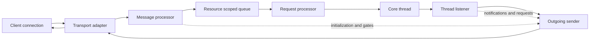
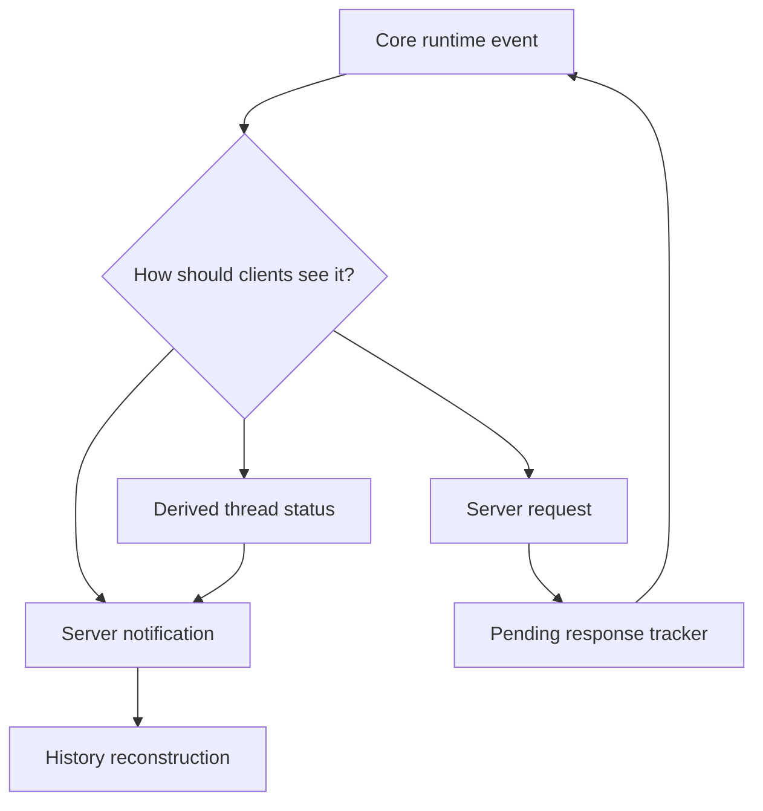

# 第 14 章：App-Server 契约

第 13 章停在 runtime 边界：permissions、sandbox selection 和 managed
networking 决定一次 tool attempt 可以触碰什么。本章再往外走一层。当 runtime
已经能够执行这些决策，它还需要一份契约，让 terminal client、SDK client、
daemon 管理的 client 和 remote client 共享同一套 thread，而不是共享同一份实现。

App-server 就是这份契约。它很容易被误读成一个本地 Web API：请求进来，响应出去，状态藏在 server 后面。源码里的结构更接近一个运行在本机、也可能跨过 remote-control bridge 的小型分布式系统。它负责统一 transports，按资源序列化工作，把 runtime events 转成 client 可见的 items，保存足够的历史以便 client 重新加入，并在 runtime 需要人或 client 做决定时发出 server-to-client requests。

更有用的心智模型不是“core 外面包了一层 HTTP”，而是“围绕 thread ownership 的 protocol boundary”。Client 不拥有 agent loop。Client 拥有 connection、capabilities、UI state，以及对 server requests 的响应。Server 拥有 thread lifecycle、turn submission、replay、status derivation，以及 core events 到公开契约的映射。


<div class="source-equivalence">

## 源码地图

| 概念 | 源码锚点 |
| --- | --- |
| Protocol envelopes and schemas | [`codex-rs/app-server-protocol/src`](https://github.com/openai/codex/tree/569ff6a1c400bd514ff79f5f1050a684dc3afde3/codex-rs/app-server-protocol/src) |
| Transport normalization | [`codex-rs/app-server-transport/src/transport/mod.rs`](https://github.com/openai/codex/blob/569ff6a1c400bd514ff79f5f1050a684dc3afde3/codex-rs/app-server-transport/src/transport/mod.rs#L57) |
| Message processor | [`codex-rs/app-server/src/message_processor.rs`](https://github.com/openai/codex/blob/569ff6a1c400bd514ff79f5f1050a684dc3afde3/codex-rs/app-server/src/message_processor.rs#L272) |
| Request serialization | [`codex-rs/app-server/src/request_serialization.rs`](https://github.com/openai/codex/blob/569ff6a1c400bd514ff79f5f1050a684dc3afde3/codex-rs/app-server/src/request_serialization.rs#L19) |
| Thread state and pending requests | [`codex-rs/app-server/src/thread_state.rs`](https://github.com/openai/codex/blob/569ff6a1c400bd514ff79f5f1050a684dc3afde3/codex-rs/app-server/src/thread_state.rs#L70) |

</div>

## 契约表面

App-server protocol 有四种可见形状。

| 形状 | 方向 | 作用 |
| --- | --- | --- |
| Client request | client 到 server | 请求 initialize、start/resume thread、begin/interrupt turn、列出 capability、读取状态，或执行旁路操作。 |
| Client response | server 到 client | 用成功或失败完成某个 request id。 |
| Server notification | server 到 client | 广播 thread、turn、item、status 或 lifecycle 的可观察变化。 |
| Server request | server 到 client，再返回 | 请求 client 或用户审批、补充输入、刷新认证、运行 client-owned tool，或回答 elicitation。 |

这些形状重要，是因为它们避免架构坍缩。如果 client 只收到终端文本，就只能猜发生了什么。如果 client 只能发送命令，runtime 就无法向它请求决定。契约必须是双向的，因为 agent runtime 本身就是双向的：它产生 observations，也可能在继续之前需要新的授权。



这张图省略了很多具体 request family，但保留了支配性思想：incoming bytes 不能直接进入 core。它们要经过 transport normalization、initialization checks、feature gates、resource serialization 和 request processors。Outgoing data 也不是裸 core event stream，而是经过 lifecycle handlers、history builders、pending request tracking、compatibility filtering 和每个 connection 的 send queue。

## Transport Normalization

App-server 可以通过多种 transport 访问：standard I/O、本地 socket、类似 WebSocket 的 channel、in-process client，或 remote-control stream。Protocol 层不应该关心消息由哪条路径带来。它需要的是 incoming message、outgoing sender、connection metadata，以及检测 cancellation 或 disconnect 的方式。

因此，transport normalization 不是表面工程。它给 server 其他部分一套统一词汇，用来描述 framing、backpressure、close events 和 outbound queueing。Standard I/O 上的一行文本和 socket 上的一帧，都变成同一种 incoming event。Response、notification 或 server request，也都变成同一种 outbound event。Transport adapter 负责机制；message processor 负责含义。

这也解释了为什么即使所有 process 都在同一台机器上，local app-server 仍然像分布式系统。Client 可能断开。Response 可能延迟。Notification 可能需要 replay 给重新加入的 client。某个 connection 可能支持 experimental method，而另一个 connection 不支持。慢速 receiver 会带来 backpressure。契约必须显式处理这些情况，不能依赖普通函数调用的假设。

## Initialization 与 Capability Gates

Connection 使用 runtime 前，必须先说明自己是什么 client。Initialization 记录 client identity、支持的 protocol concepts 和 feature capability。之后 request handling 会应用两类检查。

第一类是正确性 gate：connection 是否已经 initialized，method 是否已知，payload 是否有效，引用的 thread 是否存在，请求在当前状态是否合法。第二类是兼容性 gate：method 是否 experimental，这个 client 是否理解 response shape，某个 notification 是否需要对该 connection 过滤或转换。

关键设计点是：capability 属于 connection，而 thread 可以被共享。Thread 可以比创建它的 client 活得更久，另一个 client 可以稍后 resume 或 observe 它。因此 app-server 不能只把“client 能理解什么”存在 thread 上；它还必须记住 connection contract，并在边界处应用它。

## Request Serialization

不是所有 request 都能同时运行。全局 settings 写入、thread resume、process operation 和 filesystem watch update 会干扰不同资源。App-server 使用 resource-scoped serialization，所以不必在“不安全并发”和“一个全局大锁”之间二选一。

| 序列化范围 | 为什么存在 |
| --- | --- |
| Global state | 防止共享 configuration 或 account state 出现冲突更新。 |
| Thread | 保证同一 thread 的 turn start、resume、interrupt 和 history change 有序。 |
| Path | 避免观察或修改同一路径的 filesystem operations 互相竞争。 |
| Process | 防止 process lifecycle messages 互相越过。 |
| OAuth 或 connector state | 防止重复 refresh 或外部 auth transition 不一致。 |

这也是“app-server 只是 API”这个模型不够用的地方。普通 API handler 往往立即开始工作；app-server 会先问：这个 request 应该和哪个资源串行化？然后才调用执行操作的 processor。

```text
pseudocode: message handling

当 transport message 到达:
    parse protocol envelope
    找到 connection state

    如果 connection 尚未 initialized:
        只允许 initialization-compatible methods

    检查 method、payload 和 capability gates
    计算 request 的 serialization key

    把 request 排到该 key 对应队列后面

    当 request 到达队首:
        调用匹配的 request processor
        processor 完成后发送 response
```

这段 pseudocode 故意保持朴素。架构事实是 validation 和 execution 之间的 queue。正是这个 queue，把多个并发 client 变成对共享 runtime state 的有序操作。

## Threads、Turns 与 Items

App-server 用用户可见模型暴露 runtime：threads 包含 turns；turns 产生 items；items 可以 replay、update 或 complete。Core 内部可以有更细的 events，但 client 不应该理解每一种内部 runtime message。它们需要一份稳定契约，说明 conversation 是什么，以及它如何变化。

Thread start 是最清楚的例子。Server 加载 effective configuration，验证 dynamic tools 和 permissions，创建或附着到 core thread，注册 listener，发送 request response，然后广播 thread 已存在。Turn start 类似但范围更窄：验证 input 和 overrides，把 operation 提交给 core thread，把 request id 关联到生成的 turn id，用 in-progress state 响应，然后让 live notifications 承载后续进展。

Response 和 notification 的分离非常关键。Request response 表示 server 接受并启动了操作；notifications 表示操作在时间中发生了什么。这样 long-running turn 不会阻塞整个 request processor，同时 client 仍然能获得结构化进度。

## Event Mapping

Core runtime 用自己的词汇发出 events。App-server 把这些 events 映射成 client-facing notifications 和 server requests。有些映射很直接：turn started、item appeared、output grew、command finished、turn completed。另一些是 lifecycle decisions：thread 变成 idle、active、input-pending 或 system-error。还有一些是双向的：file change 或 command approval 需要 client 回答后才能继续。



这个 mapping layer 也是 app-server 保护 clients 免受内部变化影响的地方。Core 可以增加更细的 event，或改变内部 rollout 表达，而不强迫每个 client 同时改变。公开契约应该有意识地演进：新的 item kind、新的 notification fields、新的 server request，都应该通过版本或 gate 管理，让 client 能承受过渡期。

## Replay 与 Rejoin

Threads 足够持久，client 可以离开后再回来。Rejoin 不只是“打开当前 transcript”。Server 必须从存储的 rollout data 重建 client view，然后接入 live stream，并且不能丢失或重复 events。

这里的 ordering 问题很细。假设 client 在一个 turn 仍在 streaming 时 resume thread。Server 必须 replay committed history、attach listener，然后按 client 可渲染的顺序交付 live notifications。如果 replay 和 live subscription 竞争，UI 可能显示重复 items，漏掉 pending approval，或者在 thread 仍 active 时报告 idle。

App-server 用 thread 周围的 listener state 和 command queues 解决这个问题。Resume operation 可以向已加载 thread 请求有序 replay 和 subscription behavior，而不是在旁边重建第二份模型。得到的状态来自 runtime facts：loaded state、active turns、pending approvals、pending user input、system errors 和 listener history。

## Server-To-Client Requests

Server requests 是这份契约最能区分 agent runtime 和传统服务的部分。Server 可以在 runtime 继续之前，请 client 做一件事。

常见 request family 包括：

| Request family | Client responsibility |
| --- | --- |
| Command 或 file approval | 展示风险，并返回 allow、deny 或 modified decision。 |
| User input | Runtime 等待时向用户索取更多信息。 |
| MCP elicitation | 展示 tool server 对用户提供数据的请求。 |
| Dynamic tool execution | 运行 client-owned tool，并返回结构化结果。 |
| Auth refresh 或 attestation | 完成 client-visible 的 trust 或 identity step。 |

Server 会跟踪这些 pending requests，因为它们属于 turn state。Runtime 正等待某个 client 回答时，client disconnect 不能被当作无害 UI 事件。根据 request type 和 policy，server 可能 cancel、timeout、reassign、replay，或报告 turn 正处于 input-pending。

## Backpressure 与 Overload

契约也必须说明 clients 或 transports 跟不上时会发生什么。没有 backpressure，快速 runtime 会构造无界 outbound queues，或者嘈杂 client 会用 work 淹没 processor。App-server 把 overload 当作 protocol concern，而不仅是日志 concern。

Ingress backpressure 保护 request processing。Outbound backpressure 保护每个 connection。Resource queues 保护共享 state。Pending server requests 防止双向工作被遗忘。这些机制并不华丽，但它们定义了产品的可靠性边界。如果一个 well-typed notification 在描述关键状态转换时被静默丢弃，它就没有实际价值。

## Derived Status

Clients 想要简单 status：loaded、idle、active、waiting for input、waiting for approval 或 failed。Runtime 并不把这个 status 存成一个单一 truth field。它从事实派生：thread 是否 loaded，是否有 active turn，是否有 pending server requests，listener 是否看到未恢复的 system error，当前 operation 是否在等待用户输入。

Derived status 比复制状态更安全。如果 server 维护一个独立的 `threadStatus` 字段，每个边缘情况都可能造成 drift。Derivation 让 server 从同一批 events 和 pending-work records 重建 status，而这些事实也正是 replay 的来源。

## Trace Ledger

| 问题 | 第 14 章答案 |
| --- | --- |
| 用户请求现在在哪里？ | 它已经跨过 client connection，并作为针对共享 thread state 的 protocol request 存在。 |
| 什么数据结构携带它？ | Transport events、protocol envelopes、connection capability、resource queues、request processors、thread listeners 和 outgoing senders。 |
| 谁拥有下一步决策？ | Message processor、resource serializer、相关 request processor、core thread，或正在回答 server request 的 client。 |
| 这里可能怎么失败？ | Initialization mismatch、unsupported capability、malformed payload、resource contention、overload、disconnect、replay race，或 unanswered server request。 |

## 应用到实践

1. **先定义契约，再做便利性。** 先确定稳定的 client-visible shapes，再优化某一条 client path。
2. **按资源序列化。** 用 scoped ordering 保护共享状态，而不是依赖全局瓶颈或不安全并发。
3. **区分接受与进展。** 快速返回 request acceptance，把 long-running work 作为 notifications streaming 出去。
4. **显式建模双向性。** 把 approval、elicitation 和 dynamic tool execution 建模为 server requests，而不是隐藏 callback。
5. **从事实派生 status。** 用 events 和 pending work 重建 client status，而不是维护第二套 transcript model。

## 收束

App-server 契约把 runtime 变成共享平台。Client 可以创建 threads、观察 turns、replay history、回答 requests，而不需要导入 core runtime。第 15 章继续看使用这份契约的客户端：generated SDK models、language-specific facades、local daemon 和 remote-control streams。
