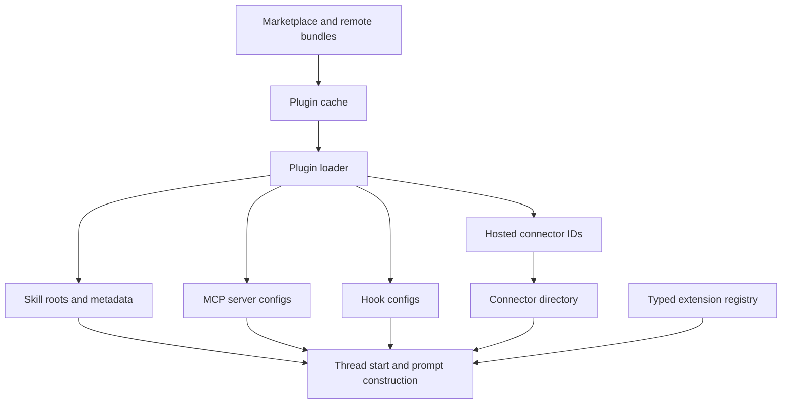

# 第 18 章：Skills、Plugins、Connectors 与类型化扩展

第 17 章把 MCP 描述成 runtime tool protocol：外部 servers 被发现、整理、路由和观察，但不进入核心 turn loop。本章上移一层。一个工具被路由之前，系统必须先决定哪些 instructions、packages、hosted app identities 和 in-process contributors 能塑造 thread。

<div class="chapter-lede">
  <p><strong>你在这里：</strong>外部 tool calls 已经有清晰协议边界。</p>
  <p><strong>问题：</strong>agent platform 需要 extension packages、workflow instructions、hosted app metadata 和 compiled contributors，但它们的 trust model 各不相同。</p>
  <p><strong>心智模型：</strong>Codex 有四个 extension planes：skills 教行为，plugins 打包资产，connectors 描述 hosted app access，typed extensions 贡献 in-process state。</p>
</div>

这些 surface 彼此相关，但不能互换。Skill 主要是 model-instruction 与 workflow unit。Plugin 是 distribution package，可以包含 skills、MCP server definitions、hooks 和 app connector IDs。Connector 是绑定 account access 的 hosted app metadata。Typed extension 编译进进程，通过显式 traits 贡献能力，而不是动态 plugin ABI。

只要保持这些 planes 分离，架构就很容易读懂。



这张图刻意不是单线 pipeline。Extension loading 是多个平面汇合到 thread construction、tool exposure 和 runtime policy。

## Skills：带预算的 Instruction

Skill 是带名称的 instructions、metadata 与可选 workflow files。它可以来自 bundled system roots、user/admin roots、repository-local roots 或 plugins。Runtime 不是把所有 skill 直接拼进 prompt，而是发现 metadata，记录 load outcomes，在预算内渲染 summaries，并且只在 invocation rules 合理时加载完整 skill body。

这就是 skill budget 的一阶原因。Model context 是稀缺 runtime resource。一个永远完整存在的 skill 并不是 extension，而是永久膨胀的 system prompt。Codex 因而把 skills 视为 available capabilities：summary 可以被展示，full body 可以在显式或隐式触发时进入上下文。

显式 invocation 是干净路径：用户或结构化输入点名某个 skill。隐式 invocation 更像推断：系统可以注意到与 skill 相关的 command 或 file access pattern。两条路径都应该留下可审计解释，说明 skill 为什么进入这个 turn。

```text
// Pseudocode - illustrative pattern.
available_skills = discover_skill_roots(config, plugins, repository)
summaries = []

for each skill in available_skills:
    outcome = parse_metadata(skill)
    if outcome.valid:
        summaries.append(render_summary(outcome.metadata))
    else:
        record_warning(outcome.problem)

prompt.add(fit_to_budget(summaries))

for each mention in user_input:
    skill = resolve_skill_mention(mention)
    if skill.allowed:
        prompt.add(load_full_skill_body(skill))
```

这段 pseudocode 是泛化表达，但不变量很具体：discovery、summary 和 full-body loading 是不同阶段。

## Plugins：Packaging 与 Distribution

Plugins 回答另一个问题：extension assets 如何到达本地并保持更新？Plugin 可以从 marketplace 安装，从 cache 加载，从 remote sources 同步，被分享，并被拆成多种 contribution types。这个拆分就是架构要点。Plugin 本身不是 runtime tool；它是一个 package，可能贡献 skill roots、MCP server definitions、connector IDs 和 hooks。

Packaging 层必须严格处理 trust。Marketplace names、remote plugin IDs、archive entries、bundle paths 和 plugin-relative paths 都需要验证。如果 plugin loader 接受任意路径，它就已经从 extension loading 跨到了 filesystem authority。

Plugin sync 也应被视为 eventually consistent。Marketplace lookup 可能失败，remote bundle 可能陈旧，startup refresh 有价值，但不应该变成每个 thread 的硬依赖。好的 extension infrastructure 会把这些情况记录成 load outcomes：installed、skipped、invalid、unavailable 或 warning-producing。

## Connectors：Hosted App Metadata

Connectors 规范化 hosted app directory metadata。它们回答：这是哪个 app identity，客户端该展示什么 display name，已知 tools 有哪些，logo 或 directory data 是什么，当前 account 是否可以访问。这个 metadata 与 MCP 和 hosted app tools 相关，但它不是 MCP server。

关键拆分是 directory knowledge 与 accessible capability。Directory 可以描述某个 app，即使用户尚未认证。Runtime 因而可以展示 connector，请求 authentication，然后只在 access metadata 支持时暴露 hosted tools。

## Typed Extensions：编译期贡献

Typed extensions 是四个 planes 中动态性最低的。它们是通过显式类型注册的 in-process contributors。它们不在运行时加载任意代码，而是通过窄 API 参与：贡献 thread-start state、prompt fragments，或 app-server 与 runtime 知道如何消费的其他 typed data。

这让 typed extensions 适合内部集成点：extension author 与 runtime author 共享 compile-time contract。它也解释了为什么 typed extensions 不是 plugins 的替代品。Plugins 分发 configuration 与 workflow assets；typed extensions 通过 build 贡献 code。

## Trust 与 Fail-Soft Loading

Extension loading 必须既严格又宽容。严格，是对正在验证的边界严格；宽容，是对可选 capability 的失败宽容。Invalid metadata 不应成为 prompt text。缺失 connector 不应让 thread startup 崩掉。Plugin path 如果逃出允许的 bundle，就不应被跟随。Remote sync failure 应可见，但当 cache 足够时，普通本地工作应该继续。

| Plane | Trust question | Fail-soft behavior |
| --- | --- | --- |
| skills | metadata 是否可解析，且被 policy 允许？ | 跳过 invalid entries 并报告 warnings |
| plugins | package identity 与 path layout 是否可信？ | 加载 valid contributions，忽略 rejected ones |
| connectors | hosted metadata 是否可用，当前 account 是否可访问？ | 展示 unavailable 或 auth-needed state |
| typed extensions | compiled contributor 是否匹配 registry contract？ | 尽早拒绝 incompatible typed data |

这个模式比任何单个文件都重要。Extension systems 想长期稳定，就要让每个边界有自己的 validation 与 degraded mode。

```text
// Pseudocode - illustrative pattern.
plugin = load_plugin_from_cache(plugin_id)
if not plugin.valid:
    record_load_outcome(plugin_id, "invalid")
    continue

for each contribution in plugin.contributions:
    if contribution.kind == "skill":
        register_skill_root(validate_plugin_relative_path(contribution.path))
    if contribution.kind == "mcp_server":
        register_mcp_server(validate_server_config(contribution.config))
    if contribution.kind == "hook":
        register_hook(validate_hook_config(contribution.config))
    if contribution.kind == "connector":
        register_connector_id(validate_connector_id(contribution.id))
```

Loader 是 classifier 和 validator。它不应该把 plugin 字段静默变成 runtime authority。

<div class="trace-ledger">

## Trace Ledger

| 问题 | 第 18 章答案 |
| --- | --- |
| 用户请求现在在哪里？ | 它在 thread startup 之前和期间被 extension context 塑形。 |
| 什么数据结构携带它？ | skill metadata、plugin load outcomes、connector directory entries、MCP configs、hook configs 和 typed extension state。 |
| 谁拥有下一步决策？ | policy、loaders、registries、prompt construction、connector auth state，最后才是模型。 |
| 这里可能怎么失败？ | invalid metadata、untrusted bundle paths、marketplace 或 remote sync failure、missing connector access、disabled skills 或 incompatible typed data。 |

</div>

<div class="apply-this">

## 应用到实践

1. **平面分离。** 解决扩展系统膨胀 -> 保持 skills、plugins、connectors、typed extensions 各自独立 -> 风险：让每种包格式都拥有同等 runtime 权威。
2. **预算化渲染。** 解决扩展导致 prompt 变大 -> 先总结 metadata，再加载完整正文 -> 风险：过度压缩导致关键约束不可见。
3. **验证贡献路径。** 解决 plugin 路径逃逸 -> 注册资产前验证 plugin-relative path -> 风险：把 manifest 字符串当成文件系统权威。
4. **Connector 间接层。** 解决 hosted app access 混乱 -> 分开 directory metadata 和账户可用工具 -> 风险：把不可用工具展示成可调用能力。
5. **类型化编译边界。** 解决进程内扩展安全 -> 用 trait 或 typed API 接入 compiled contributor -> 风险：把 typed extension 变成任意动态代码加载。

</div>

## 接下来

Extension loading 只解决兼容性的一半。第 19 章转向 external migration：Codex 如何从其他 agent systems 导入 configurations 与 sessions，同时不假装它们的语义完全相同。

<div class="source-equivalence">

## 源码地图

| 概念 | 源码锚点 |
| --- | --- |
| Skills manager | [`codex-rs/core-skills/src/manager.rs`](https://github.com/openai/codex/blob/569ff6a1c400bd514ff79f5f1050a684dc3afde3/codex-rs/core-skills/src/manager.rs#L51) |
| Skill metadata model | [`codex-rs/core-skills/src/model.rs`](https://github.com/openai/codex/blob/569ff6a1c400bd514ff79f5f1050a684dc3afde3/codex-rs/core-skills/src/model.rs#L12) |
| Plugin manifest | [`codex-rs/core-plugins/src/manifest.rs`](https://github.com/openai/codex/blob/569ff6a1c400bd514ff79f5f1050a684dc3afde3/codex-rs/core-plugins/src/manifest.rs#L38) |
| Plugin manager | [`codex-rs/core-plugins/src/manager.rs`](https://github.com/openai/codex/blob/569ff6a1c400bd514ff79f5f1050a684dc3afde3/codex-rs/core-plugins/src/manager.rs#L396) |
| Connector directory model | [`codex-rs/connectors/src/lib.rs`](https://github.com/openai/codex/blob/569ff6a1c400bd514ff79f5f1050a684dc3afde3/codex-rs/connectors/src/lib.rs#L66) |
| Typed prompt extension API | [`codex-rs/ext/extension-api/src/contributors/prompt.rs`](https://github.com/openai/codex/blob/569ff6a1c400bd514ff79f5f1050a684dc3afde3/codex-rs/ext/extension-api/src/contributors/prompt.rs#L12) |

</div>
