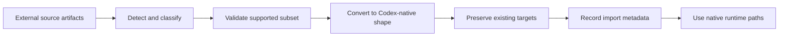
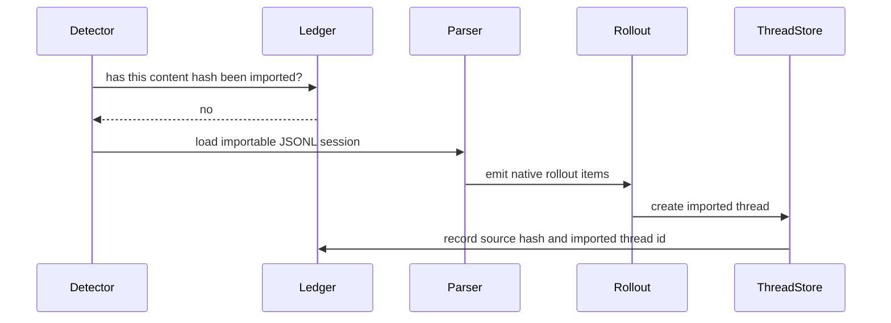

import CompatibilityLaneBoard from "../../../src/components/visual/CompatibilityLaneBoard.tsx";

# 第 19 章：外部迁移与向后兼容

<CompatibilityLaneBoard lang="zh" client:visible />

第 18 章把 extension planes 拆成 skills、plugins、connectors 和 typed extensions。本章追问：当用户带着并非诞生于这些 planes 的既有 agent configurations 与 histories 进入 Codex 时，系统应该怎么办？Migration 是桥，compatibility 是纪律，防止这座桥变成一堆不可维护的特判。

<div class="chapter-lede">
  <p><strong>你在这里：</strong>Codex 已能在明确 trust boundaries 下加载原生 extension surfaces。</p>
  <p><strong>问题：</strong>用户会带来 external configs、commands、hooks、subagents、MCP servers 和 JSONL sessions，但它们的语义不完全匹配 Codex。</p>
  <p><strong>心智模型：</strong>migration 是保守地翻译成 native artifacts 并附带 metadata，而不是模拟另一个 agent runtime。</p>
</div>

Agent system 的 backward compatibility 不只是接受旧 API 字段。它还意味着接纳用户已有历史、工作习惯和本地自动化，同时不能让模糊行为变成隐藏权限。Codex 把 migration 当作受控 import path：读取 source artifact，识别 supported constructs，翻译成 Codex-native shapes，跳过 unsafe 或 dynamic cases，并记录足够 metadata 以避免重复导入。



最后一个节点很重要。迁移后的 hook 应作为 Codex hook 运行；迁移后的 command 应表现为 Codex skill 或 workflow unit；导入的 session 应成为 rollout history。Migration layer 不应该留在 turn loop 里。

## Configuration Migration

External configuration migration 处理几类 artifact：

| Source artifact | Native destination | Conservative rule |
| --- | --- | --- |
| MCP server entries | Codex MCP configuration | 导入 supported transports，跳过 disabled 或 unsupported entries |
| hooks | Codex hook configuration | 只转换能匹配 structured hook model 的 handlers |
| commands | skills 或 workflow units | 要求稳定 metadata，跳过 dynamic runtime expansion |
| subagents | agent definitions 或 skill-like instructions | 只保留 Codex 能安全表达的 fields |

保守规则就是架构。Migration 绝不应该猜测 permission boundary。如果外部 command 依赖 provider-specific runtime expansion，安全行为是跳过并说明原因。如果某个 hook handler 无法表示为 Codex hook schema，安全行为不是把它伪装成任意 shell text。若目标文件已经存在，importer 应保留用户已有 native configuration，而不是覆盖。

```text
// Pseudocode - illustrative pattern.
for each source_entry in external_config:
    kind = classify(source_entry)

    if not supported(kind, source_entry):
        report_skip(source_entry, reason)
        continue

    target = compute_native_target(source_entry)
    if target.exists:
        report_preserved(target)
        continue

    native_artifact = convert_to_codex_shape(source_entry)
    write_native_artifact(target, native_artifact)
```

这是通过翻译实现 compatibility，而不是通过无边界解释实现 compatibility。

## Session Import

Session import 与 config migration 不同，因为 history 不是未来能力，而是过去对话的证据。External JSONL sessions 可能包含 user messages、assistant messages、tool calls、tool outputs、titles、working directories、token usage 和 source-specific records。Codex 必须把足够多历史翻译成自己的 rollout items，才能让 thread 与 history reconstruction 理解。

Import path 因此会检测 candidate sessions，验证 working context 仍存在，只加载 importable records，构建 visible turns，添加 import metadata，并记录 content-hash ledger。Ledger 防止重复导入，同时允许 source content 改变后再次被发现。



这个设计同时保留两个事实：导入对话可作为 Codex history 使用；它也仍然带着 imported history 的 provenance。

## 不让兼容变成语义漂移

最危险的 migration bug 不是 parse failure，而是成功导入后改变了含义。Agent systems 在 prompt rules、tool call formats、hook timing、permission models、command expansion、subagent behavior 和 history schemas 上都可能不同。Converter 如果过度聪明，就会创建看似有效、却行为不同的 native artifact。

Codex 用三条 compatibility rules 降低这种风险。

第一，保留 native user work。已有 target files 优先于 imported material。第二，跳过 native runtime 无法表达的 dynamic behavior。第三，附加 import metadata，让后续代码和用户能区分 native history 与 migrated history。

这些规则并不花哨，但它们避免 migration 变成每个后续 subsystem 里的隐藏 compatibility mode。

## Backward Compatibility Bridges

Migration 是一座桥，protocol compatibility 是另一座桥。前面章节已经介绍 generated schemas、legacy aliases、v1/v2 coexistence、experimental gates 和 client-version workarounds。第 19 章把这些想法整理成一般策略：

| Compatibility bridge | What it protects | What it should not do |
| --- | --- | --- |
| schema aliases | older clients and stored events | 隐藏不兼容语义 |
| experimental gates | unstable capabilities | 让 unstable fields 看起来像永久契约 |
| migration converters | 来自其他工具的用户 workflows | 永久模拟另一个 runtime |
| import ledgers | 幂等 session import | 压制已经改变的 source content |
| provenance markers | imported history 的可审计性 | 用私有 implementation detail 污染 model context |

共同主题是 explicitness。Compatibility code 应该说清楚它在桥接什么、跳过什么、桥接在哪里结束。

## Designing the Import Report

Import operation 即使成功也应该产出 report。用户需要知道哪些 MCP servers 被导入，哪些 hooks 被跳过，哪些 commands 变成 skills，哪些 existing files 被保留，哪些 sessions 变成 threads。Silent migration 在演示里诱人，在生产里危险。

```text
// Pseudocode - illustrative pattern.
report = {
    imported: [],
    preserved: [],
    skipped: [],
    warnings: []
}

for each artifact:
    outcome = migrate(artifact)
    report.add(outcome.category, outcome.summary)

return report
```

Report 也是 test oracle。Migration tests 应覆盖 edge behavior：disabled servers、unsupported transports、duplicate command names、missing metadata、existing targets、invalid ledgers、changed source content 和 unsupported session records。

<div class="trace-ledger">

## Trace Ledger

| 问题 | 第 19 章答案 |
| --- | --- |
| 用户请求现在在哪里？ | 它可以由 imported native artifacts 和 imported rollout history 支撑。 |
| 什么数据结构携带它？ | migration summaries、converted config artifacts、rollout items、import metadata 和 content-hash ledgers。 |
| 谁拥有下一步决策？ | converters、validators、skip rules、target preservation checks，以及 import 之后的 native runtime loaders。 |
| 这里可能怎么失败？ | unsupported source semantics、unsafe dynamic expansion、duplicate names、existing target conflicts、invalid JSONL、missing working context 或 stale import ledger data。 |

</div>

<div class="apply-this">

## 应用到实践

1. **有损导入账本。** 解决迁移过度承诺 -> 记录 skipped、converted 和 unsupported 字段 -> 风险：假装不兼容语义被完整保留。
2. **目标形状原生化。** 解决兼容层脆弱 -> 翻译成 Codex-native config、hook、skill 和 session shape -> 风险：永久携带外部 runtime 假设。
3. **信任重置。** 解决导入自动化不安全 -> 让导入 hook 和 command 重新经过 Codex trust gate -> 风险：继承另一个系统的信任结论。
4. **历史来源标记。** 解决导入 transcript 混淆 -> 把迁移 item 标记为 imported history -> 风险：把导入记录和本地 rollout fact 混在一起。
5. **兼容性边界。** 解决旧客户端破坏 -> 把 legacy alias 留在协议边界 -> 风险：让兼容分支扩散到 core logic。

</div>

## 接下来

第五部到这里结束：runtime 已能接纳外部工具、加载 extension packages，并把外部历史迁移进 native contracts。第六部转向一个 turn 之外的协作：multi-agent threads、cloud tasks、identity 和 memory。

<div class="source-equivalence">

## 源码地图

| 概念 | 源码锚点 |
| --- | --- |
| External config model | [`codex-rs/app-server/src/config/external_agent_config.rs`](https://github.com/openai/codex/blob/569ff6a1c400bd514ff79f5f1050a684dc3afde3/codex-rs/app-server/src/config/external_agent_config.rs#L1) |
| Migration request processor | [`codex-rs/app-server/src/request_processors/external_agent_config_processor.rs`](https://github.com/openai/codex/blob/569ff6a1c400bd514ff79f5f1050a684dc3afde3/codex-rs/app-server/src/request_processors/external_agent_config_processor.rs#L1) |
| TUI migration startup | [`codex-rs/tui/src/external_agent_config_migration_startup.rs`](https://github.com/openai/codex/blob/569ff6a1c400bd514ff79f5f1050a684dc3afde3/codex-rs/tui/src/external_agent_config_migration_startup.rs#L1) |
| Protocol compatibility surface | [`codex-rs/app-server-protocol/src/protocol/mod.rs`](https://github.com/openai/codex/blob/569ff6a1c400bd514ff79f5f1050a684dc3afde3/codex-rs/app-server-protocol/src/protocol/mod.rs#L1) |
| Thread store | [`codex-rs/thread-store/src`](https://github.com/openai/codex/tree/569ff6a1c400bd514ff79f5f1050a684dc3afde3/codex-rs/thread-store/src) |

</div>
