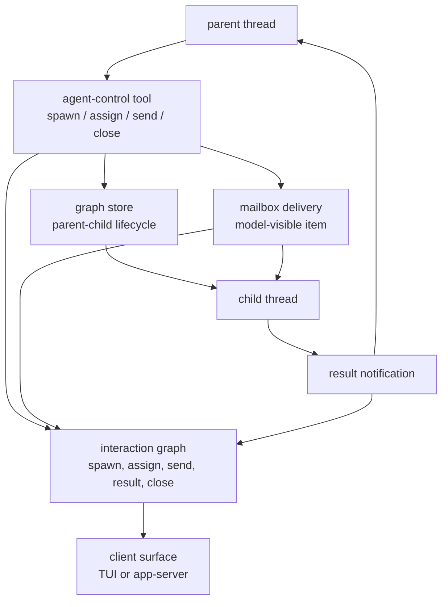
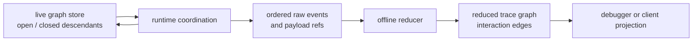

# 第 20 章：多 Agent 协作

第 19 章在第五部结尾说明了 Codex 如何迁移外部 Agent 配置和历史
session：它不会假装所有外部概念都能无损映射到 Codex，而是保守转换、
保留来源、跳过不安全形态。本章把这个兼容性原则推进到运行时协作：
当 Codex 已经拥有原生 thread 模型之后，多 Agent 协作就应该被表示成
thread、tool、message 和 result 之间的显式关系。

关键变化是：multi-agent 不是一组后台 prompt。它首先是一个图问题。父
thread 可以 spawn 子 thread，可以 assign 或 send 工作，可以 wait 等待，
可以接收 result，也可以 close 一段关系。每个动作都有运行时效果、面向
客户端的事件形态，以及可持久化的 trace 形态。Codex 把这些关注点分开，
所以协作关系可以恢复、调试和渲染，而不是依赖终端文本或隐藏的全局调度器。

## 协作单位仍然是 Thread

单个 Codex turn 本身已经包含很多部件：模型输入、流式输出、工具调用、
审批、hooks、持久化、取消和 replay。Multi-agent 协作没有发明第二套
runtime。它创建更多 threads，并记录信息如何在这些 threads 之间移动。

这个设计让系统保持可组合：

- 根交互 session 是一个 agent thread；
- 被 spawn 的 worker 也是一个 agent thread；
- 委派任务会作为目标 thread 的 model-visible input 被投递；
- 结果以可观察的 interaction 返回，而不是写入共享可变内存；
- close 操作更新关系生命周期，但不删除历史 trace。

父子拓扑由一个很窄的 graph store 持久化。它知道 child 最多有一条父边，
知道一条边是 open 还是 closed，也知道如何列出直接 children 或
descendants。它不知道模型如何描述任务，不知道 TUI 怎么展示 child，也
不知道 trace viewer 怎么画线。正是这种窄边界，让 live runtime 和离线
trace 可以复用同一个概念，而不共享偶然的 UI 策略。



这张图刻意把 graph persistence 和 trace reduction 分开。Graph store 回答
运行时问题，例如“哪些 descendants 仍然 open”。Trace graph 回答解释性
问题，例如“哪个 tool call 投递了导致这个 result 的任务”。

## Agent-Control Tools 是协作边

Agent-control tool 不只是普通函数调用。它会把另一个 thread 命名为对话
参与者。因此 Codex 把主要 multi-agent 动作都看成会产生关系的事件：

| 动作 | 运行时含义 | 图含义 |
| --- | --- | --- |
| spawn | 创建 child thread 并投递初始工作 | parent 拥有一条 open child edge |
| assign | 向已有 child 发送新任务 | tool edge 指向被投递的 message |
| send | 投递通信消息 | tool edge 指向被投递的 message |
| wait | 观察一个或多个 child 状态 | 运行时同步，不创建新 child |
| result | 把 child 完成结果通知 parent | child 输出链接到 parent notice |
| close | 结束 parent-child 关系 | child edge 变为 closed |

“Mailbox” 是一个有用的心智模型。发送方执行一个 tool call。接收方稍后
会在自己的 model-visible conversation 中看到一条 message。这两个观察
在 raw event stream 里不一定相邻，甚至可能先后顺序不同。因此可靠架构
不能假设发送方的 tool end event 和接收方 input item 总是挨在一起。

Codex 通过把 events reduce 成 interaction edges 来处理这个问题。一条
interaction edge 有 source anchor、target anchor、kind、时间、携带的
item ids，以及 raw evidence references。Source 可以是 tool call；target
可以是 conversation item，在失败场景下也可以退化为 thread。Edge 记录
信息流，但不声称两个端点一定同时创建。

## Live Graph 与 Trace Graph

这里有两张有用的图，混淆它们会导致设计错误。

Live graph 是紧凑的运行时索引。它保存 directional spawn edges 和
lifecycle status，优化目标是运行中的问题：列出 children、列出
descendants、过滤 open descendants、把 child 标成 closed，以及用稳定顺序
把持久化拓扑和内存状态合并起来。

Trace graph 是语义重建。它从捕获后的 raw protocol、runtime、tool 和
model-facing events 生成，优化目标是解释：哪个 inference 产生了 tool
call，哪个 runtime payload 开始或结束了它，哪个 mailbox item 接收了消息，
哪个 parent notification 表示 child result。



Live graph 应该保持小，因为它参与运行时。Trace graph 可以更丰富，因为
它是 replay artifact。这就是第 8 章的“先观察，再解释”模式在多 Agent
协作里的应用。

## Pending Queue 把 Race 显式化

Reducer 最难的部分不是识别 spawn 或 send。难点是排序。Parent 可能先完成
tool call，而 child 的 model-visible task item 还没出现。Child 可能在最终
assistant message 出现之前失败。Close 操作可能命名了一个从未参与 trace
的目标。Result notification 可能来自 runtime status，而不是普通
conversation content。

Reducer 用 pending queue 处理这些情况。只要 sender 侧证据足够，它先记录
一条待完成 edge。稍后，当匹配的 recipient-side item 被 reduce 出来时，
它再把 edge materialize 到精确的 target item。如果 target item 永远没有
出现，但 child thread 确实存在，spawn edge 可以退回到 thread target。
如果目标完全没有参与 trace，raw payload 会保留在 tool call 上，而不是
虚构一个端点。

```text
// Pseudocode - illustrative pattern.
procedure reduce_agent_event(event):
    if event starts_agent_tool:
        remember_tool_runtime_payload(event)

    if event ends_spawn_tool and event.created_child_thread:
        pending = edge_from_tool_to_child_message(event)
        queue_or_resolve(pending)

    if event ends_message_tool:
        pending = edge_from_tool_to_mailbox_message(event)
        queue_or_resolve(pending)

    if event observes_child_result:
        pending = edge_from_child_output_to_parent_notice(event)
        queue_or_resolve(pending)

    if event reduces_conversation_item:
        for pending_edge matching item.thread and item.content:
            materialize_edge(pending_edge, target=item)

procedure finish_replay():
    for pending_spawn with existing_child_thread:
        materialize_edge(pending_spawn, target=child_thread)
```

这段是伪代码，不是源码。架构重点是 queue：reducer 不强行立刻创建所有
edge。它等待更好的 target 出现，只在 runtime 证据仍然证明关系真实存在时
才使用 fallback。

## Descendant Traversal 是策略选择

列出 descendants 听起来是机械操作，但它编码了策略。当调用方请求 open
descendants 时，Codex 只沿 open edges 继续遍历。这意味着如果一个 closed
child 下面还有 open grandchild，那个 grandchild 也不会被返回。Filter 不只
过滤最终结果，它还剪枝 traversal。

这个行为很重要，因为“open collaboration tree”是运行时问题。如果一条
parent-child edge 已经 closed，parent 不应该意外找回这条 closed 分支下面
的工作，并把它当成仍然活跃。完整审计或 trace viewer 仍然可以在无 status
filter 的情况下查看历史图；运行时协作需要更严格的解释。

另一个细节是：更新缺失 child 的 status 可以是成功 no-op。这让 close
处理在 race 和局部状态下保持幂等。Close event 可以被 replay，也可以在
清理之后到达，而不会让 graph store 变成不必要错误的来源。

## Collaboration Events 是产品事件

Multi-agent 协作必须对客户端可见。否则用户无法理解 child 为什么存在、
任务为什么还在跑、result 为什么出现在 parent thread 中。因此 Codex 除了
修改 thread state，还会发出 collaboration events。这些 events 让客户端
渲染 child status、mailbox delivery、result notification 和 close
operation，而不用反向解析 tool output。

架构边界是：

- runtime tools 创建或观察协作效果；
- protocol events 把这些效果描述给客户端；
- graph store 保存当前拓扑；
- rollout trace 保存证据并重建语义 edges；
- client projections 从结构化数据渲染状态和历史。

这避免了一个常见失败模式：parent transcript 成为协作的唯一记录。
Transcript 可能被 compact、summary 或为了人类阅读而格式化；协作需要比
自然语言更强的 identity 和 lifecycle 语义。

## 失败模式

Multi-agent 系统在丢失 identity 时会变得非常难解释。Thread id、agent
path、tool call id、model-visible call id 和 conversation item id 服务于
不同目的。Child thread 的 nickname 是 presentation metadata，不是身份。
Tool call 证明 parent 请求了一个动作；receiver-side conversation item
证明消息在哪里进入 child。Result notification 证明结果投递给 parent，
但不一定证明 child 产生了普通 assistant message。

Trace reducer 在会污染图的地方很严格：它拒绝冲突的 pending edges、重复的
model-visible tool 关系、缺失必要 turn 的事件，以及不一致的 tool-call
配对。它也会在 runtime 合法 race 的地方保持宽容：pending queues、spawn
fallback target、缺失 close target，以及在 final assistant item 不可用时
把 result edge anchor 到 child thread。

设计经验是：可靠协作既不是“全部接受”，也不是“缺一个细节就失败”。它保留
证据，只在有依据时创建语义 edge，并把未解决事实附着到最近的真实对象上。

## 应用到实践

1. **Thread-as-participant。** 解决 subagent 不可见的问题；把每个 agent
   建模成有身份和生命周期的 thread；风险是把 subagent 当成匿名后台任务。
2. **图边记录。** 解决协作 replay 问题；持久化 spawn、message、wait、
   close、resume 关系；风险是只从终端输出推导协作状态。
3. **有边界的委派。** 解决无限并行问题；强制 depth、ownership 和 status
   限制；风险是让委派比认真拆任务更便宜。
4. **结果 envelope。** 解决 child outcome 不一致问题；返回结构化 success、
   failure、interruption summary；风险是把子任务失败压平成 prose。
5. **父线程可见进展。** 解决隐藏工作问题；把 child event 投影成 parent
   thread 里的 collaboration event；风险是把 child 的每个实现细节都刷到
   parent。

## 收束

Multi-agent Codex 仍然是 Codex：threads、turns、tools、events 和可 replay
状态。新增的是 interaction graph，它记录跨 thread 边界的信息流。第 21 章
会把同一原则推进到 cloud tasks：工作可以远程运行，但仍然必须以类型化 task
state、签名身份和本地验证过的 patch 回到用户手中。

<div class="source-equivalence">

## 源码地图

| 概念 | 源码锚点 |
| --- | --- |
| Graph edge status | [`codex-rs/agent-graph-store/src/types.rs`](https://github.com/openai/codex/blob/569ff6a1c400bd514ff79f5f1050a684dc3afde3/codex-rs/agent-graph-store/src/types.rs#L7) |
| Local graph store | [`codex-rs/agent-graph-store/src/local.rs`](https://github.com/openai/codex/blob/569ff6a1c400bd514ff79f5f1050a684dc3afde3/codex-rs/agent-graph-store/src/local.rs#L13) |
| Agent trace reducer | [`codex-rs/rollout-trace/src/reducer/tool/agents.rs`](https://github.com/openai/codex/blob/569ff6a1c400bd514ff79f5f1050a684dc3afde3/codex-rs/rollout-trace/src/reducer/tool/agents.rs#L1) |
| Session multi-agent integration | [`codex-rs/core/src/session/multi_agents.rs`](https://github.com/openai/codex/blob/569ff6a1c400bd514ff79f5f1050a684dc3afde3/codex-rs/core/src/session/multi_agents.rs#L1) |
| Multi-agent tool handlers | [`codex-rs/core/src/tools/handlers/multi_agents.rs`](https://github.com/openai/codex/blob/569ff6a1c400bd514ff79f5f1050a684dc3afde3/codex-rs/core/src/tools/handlers/multi_agents.rs#L1) |

</div>
