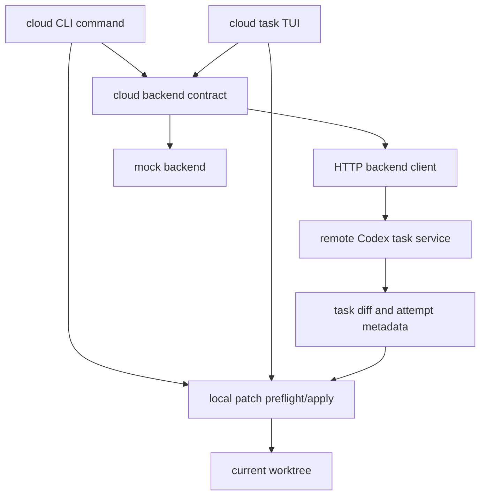
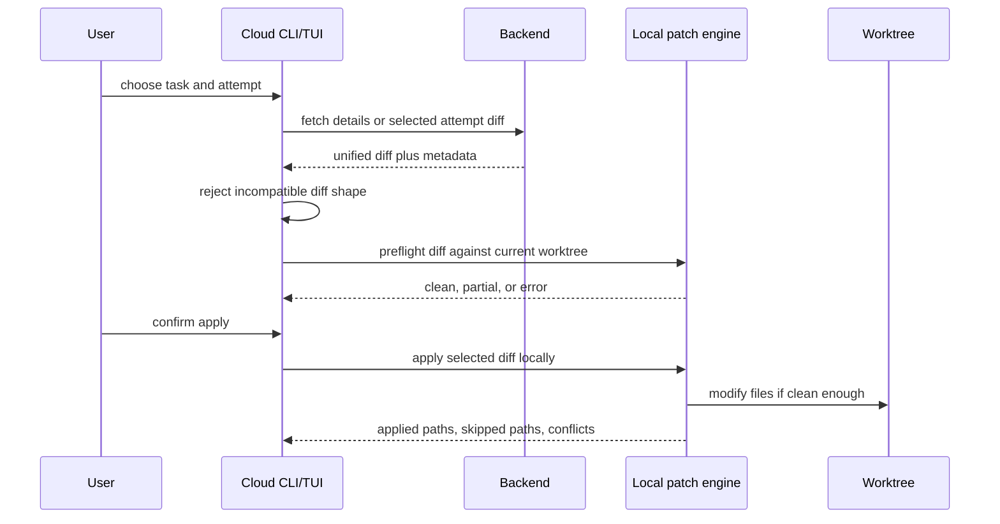
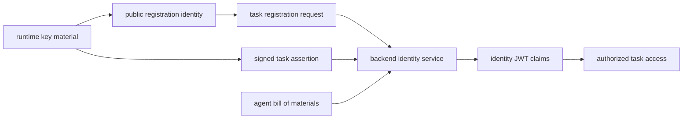

# 第 21 章：云端任务、身份与远程工作

第 20 章说明了本地多 Agent 协作为什么要显式化每一段关系：spawn edge、
mailbox delivery、result edge 和 close event。本章把同样的纪律推进到
远程工作。Cloud tasks 不是隐藏在按钮后面的第二套 agent loop。它是一个
backend task workflow，有自己的身份、环境、attempts、diffs 和本地 apply
路径。

这个分离非常关键。Local Codex turn 会流式输出模型结果，并在本地权限上下文
里执行工具。Cloud task 会把工作提交到 backend environment，稍后获取 task
state，并可能把返回的 patch 应用到当前工作树。这两个体验相关，但不是同一
个执行边界。

<div class="source-equivalence">

## 源码地图

| 概念 | 源码锚点 |
| --- | --- |
| Cloud task API | [`codex-rs/cloud-tasks-client/src/api.rs`](https://github.com/openai/codex/blob/569ff6a1c400bd514ff79f5f1050a684dc3afde3/codex-rs/cloud-tasks-client/src/api.rs#L22) |
| HTTP backend client | [`codex-rs/cloud-tasks-client/src/http.rs`](https://github.com/openai/codex/blob/569ff6a1c400bd514ff79f5f1050a684dc3afde3/codex-rs/cloud-tasks-client/src/http.rs#L24) |
| Mock backend | [`codex-rs/cloud-tasks-mock-client/src/mock.rs`](https://github.com/openai/codex/blob/569ff6a1c400bd514ff79f5f1050a684dc3afde3/codex-rs/cloud-tasks-mock-client/src/mock.rs#L1) |
| Agent identity material | [`codex-rs/agent-identity/src/lib.rs`](https://github.com/openai/codex/blob/569ff6a1c400bd514ff79f5f1050a684dc3afde3/codex-rs/agent-identity/src/lib.rs#L40) |
| Local diff discipline | [`codex-rs/core/src/turn_diff_tracker.rs`](https://github.com/openai/codex/blob/569ff6a1c400bd514ff79f5f1050a684dc3afde3/codex-rs/core/src/turn_diff_tracker.rs#L18) |

</div>

## Task Workflow 是 Backend Contract

Cloud task client 围绕一个小的 backend interface 组织。它能 list tasks、
获取 summary、获取 diff、获取 assistant messages、获取 task text、列出
sibling attempts、创建 task、执行 apply preflight，以及 apply task。这个
interface 把 HTTP 路径细节从 CLI 和 TUI 中隔离出去，也让 mock backend 能在
开发和测试中满足同一个 contract。



这个布局避免 UI 变成 task 语义的事实来源。列表视图可以过滤 review-only
tasks，diff overlay 可以在 attempts 之间切换，modal 可以展示 apply
conflicts。这些都是呈现选择。Backend contract 是远端状态的架构中心，而
local patch path 才是能修改当前 checkout 的路径。

Task 数据模型刻意保持紧凑：

| 概念 | 含义 |
| --- | --- |
| task id | 一个 cloud task 的稳定 handle |
| task summary | title、status、environment label、更新时间、diff summary |
| task text | 创建 prompt、messages、turn id、sibling attempt ids |
| turn attempt | best-of-N task 中的一次 assistant attempt |
| apply outcome | 本地结果：success、partial 或 error，并附带相关 paths |

Status 词汇保持很小，原因和第 20 章的 graph store 很像。产品接入面需要可预测
状态机；更复杂的 backend body 可以在 client boundary 后被解析和映射。

## 创建任务先解析环境和分支

Cloud task 不只需要 prompt。它还需要目标 environment 和 git reference。
Codex 在调用 backend 之前先解析这两项。

Environment detection 从本地 git origins 开始。如果 origin 指向受支持的
托管仓库，Codex 会向 backend 查询 repo-specific environments。如果无法得到
足够明确的 repo-specific 选择，就退回 broader environment list。选择顺序
是：显式 label match、唯一可用 environment、pinned environment，最后才是
基于 task_count 的启发式选择。

Branch detection 也走保守路径。显式 branch 优先。否则 Codex 查询当前 git
branch，再查询 default branch，只有本地发现失败时才使用 generic default。
重点是：cloud execution 应该锚定到用户能理解的 branch，而不是埋在 request
body 里的隐式本地猜测。

```text
// Pseudocode - illustrative pattern.
procedure create_cloud_task(prompt, requested_environment, branch_override):
    backend = initialize_authenticated_backend()
    environment = resolve_environment(requested_environment)
    git_ref = resolve_branch(branch_override)
    attempts = validate_attempt_count()

    task = backend.create_task(
        environment_id = environment.id,
        prompt = prompt,
        git_ref = git_ref,
        attempts = attempts
    )

    return task_url(task.id)

procedure resolve_branch(branch_override):
    if branch_override is non_empty:
        return branch_override
    if current_git_branch exists:
        return current_git_branch
    if default_git_branch exists:
        return default_git_branch
    return generic_default_branch
```

这是伪代码，不是源码转写。它表达的是 contract：本地解析上下文，远程提交
有界请求，然后返回稳定 task handle。

## Attempts 是一等结果

Cloud tasks 支持同一项工作产生多个 assistant attempts。因此 UI 不能把
“task detail”当成单个 diff 和单个 message stream。它需要 base task、可选
sibling turns、attempt status、attempt placement、prompt text、messages，
以及每个 attempt 可能携带的 diff。

这就是 apply 和 diff commands 都接受 attempt selector 的原因。应用某个
attempt 时，应该使用那个 attempt 的 diff，而不是意外重新获取 base diff，
忽略用户选择。Task detail view 会把当前选中的 attempt 保存在 state 中，再
把这个 attempt 的 diff 和 text 拷贝到可见字段。

更广泛的架构经验是：远程工作经常返回一个 result set，而不是单个 result。
一旦 backend 可以产生多个候选，本地任何针对“答案”的操作都必须命名它选择
的是哪一个答案。

## Apply 是本地 Patch 工作

Cloud tasks 中最重要的边界是 apply。Task 可以在云端运行，但 apply 它的
diff 是本地 filesystem 操作。Codex 会获取或选择 unified diff，验证它确实
是兼容的 diff format，然后执行本地 patch preflight 或 application。Backend
不能单方面宣布用户工作树已经改变。



Preflight 很重要，因为 remote output 可能相对本地 checkout 已经过期。即使
cloud task 生成时完全正确，用户之后也可能改过文件。本地 preflight 会在真正
mutation 之前把这种不确定性变成可见结果。

Apply outcome 有三类：success、partial 和 error。Partial 不是装饰状态。
它告诉客户端：有些 paths 被应用了，或产生了 conflict，另一些被 skipped。
这会改变用户接下来应该如何检查工作树。

## Cloud TUI 是 Task Operator

Cloud TUI 不是一张薄表。它持有 task list、environment modal、best-of
attempt selector、diff overlay、prompt/messages view、background
enrichment、preflight spinner、apply spinner 和 result modal 的状态。这些
复杂度是合理的，因为远程工作是异步的，而且可能有多个结果。

但是 TUI 仍然不拥有 backend semantics。它用 backend contract 加载 tasks
和 attempts，用 environment detection helpers 填充 filters，用 apply
preflight 保护本地 mutation，用 attempt state 渲染正确 diff 或 prompt。
UI 是 task system 的操作台，不是 task system 本身。

这种区分让 remote work 不会泄漏进 local turn loop。Local session 仍然可以
使用 model streaming、tool execution、approvals 和 rollout persistence。
Cloud task browsing 和 application 是独立 flows，只在 auth、git context 和
patch application 这些边界与本机相遇。

## Agent Identity 把 Runtime 绑定到 Task

Cloud work 还需要身份。Codex 用 agent runtime key material、signed task
authorization、task registration、encrypted task ids、JWT claims 和 agent
bill of materials，把一个运行中的 agent 绑定到 backend task。

Identity layer 的职责不同于普通用户认证：

- 生成或加载 runtime key material；
- 推导可注册的 public key；
- 用 runtime key 签名 task authorization payload；
- 注册 task，并接受 plain task id 或 encrypted task id response；
- 解码 identity JWT claims，并在可信 keys 可用时执行验证；
- 附带 agent version、harness 和 running location 等 bill-of-material
  metadata。



这个设计避免把“用户已经登录”和“这个 runtime 可以代表这个 task 行动”混为
一谈。用户认证可以建立 account context；agent identity 把某个 runtime key
绑定到某个 task authorization。这个区别让 backend 可以推理远程 agent，而
不是按本地进程名盲目信任。

## 本地执行与远程执行保持分离

最容易犯的 cloud-task 错误，是把它描述成“Codex 在别处运行”。这太模糊。
Cloud task 有 backend lifecycle。Local turn 有 runtime lifecycle。它们可以
共享 prompt、diff、model 和 agent identity 等概念，但 control planes 不同。

| Local turn execution | Cloud task workflow |
| --- | --- |
| session 和 turn loop 控制 streaming | backend task status 控制 progress |
| 本地 permissions gate tools | backend environment gate remote execution |
| rollout 记录本地 runtime events | task APIs 返回 summaries、messages、diffs |
| approvals 保护本地 side effects | local preflight 保护 remote diffs 的应用 |
| client 看到 live event stream | client poll 或 fetch task detail |

这种分离解释了为什么 cloud tasks 可以集成进 Codex，而不重写 core agent
loop。系统围绕远程工作添加 task operator surface 和 identity layer；当远程
输出回到用户 checkout 时，仍然使用既有本地 patch discipline。

## 失败模式

Cloud task failures 往往是边界错误。Auth 可能缺失，或不是 cloud task 所需
的 backend auth 模式。Environment detection 可能找不到匹配项，或者有多个
同名 environment。Branch discovery 可能因为当前目录不是 git checkout 而
fallback。Backend detail response 可能没有 diff，可能返回不兼容 diff 形态，
也可能暴露多个 attempts，需要用户选择。本地 preflight 可能因为工作树变化而
失败。

Identity 有自己的失败模式。Runtime id 可能和 stored key material 不匹配。
JWT 可以被 decode 用于检查，但只有在可信 keys 存在时才能 verify。Registration
response 可能省略 direct task id，需要解密。这些不是 UI 错误，而是证明边界。

实践规则很简单：不要让 remote success 直接等价于 local success，直到本地
边界完成检查。Completed task 只表示 backend 产生了 outcome；它不表示用户
当前 checkout 已经接受这个 outcome。

## 应用到实践

1. **Backend/local split。** 解决 cloud-task 含混问题；分开 backend task
   lifecycle 和 local turn lifecycle；风险是把 remote success 当成 local
   mutation success。
2. **显式 environment resolution。** 解决远端目标选错问题；创建任务前解析
   repo、branch 和 environment；风险是只从 UI label 推断目标环境。
3. **Attempt selection。** 解决多 attempt 混淆问题；要求本地 action 指明
   selected attempt；风险是因为某个 diff 最新就直接应用。
4. **Local preflight。** 解决 remote diff 不安全问题；让 remote output 经过
   本地 patch 检查；风险是因为 backend completed 就绕过本地 workspace
   state。
5. **Task-scoped identity。** 解决 credential 权限过宽问题；分开 user auth
   和 signed task identity；风险是用宽泛用户凭证承担任务局部权威。

## 收束

Cloud tasks 把 Codex 扩展到单个本地 turn 之外，但没有模糊 runtime 边界。
远程工作通过 backend contracts 创建、列出、检查和授权；本地 mutation 仍然
经过本地 patch checks。第 22 章会把同样的分离用于长期状态：memories 有用，
是因为它们是受控 side channel，而不是偷偷变成另一份 chat history。
