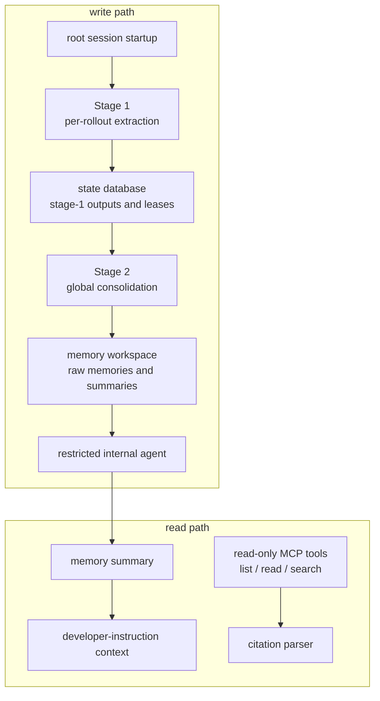
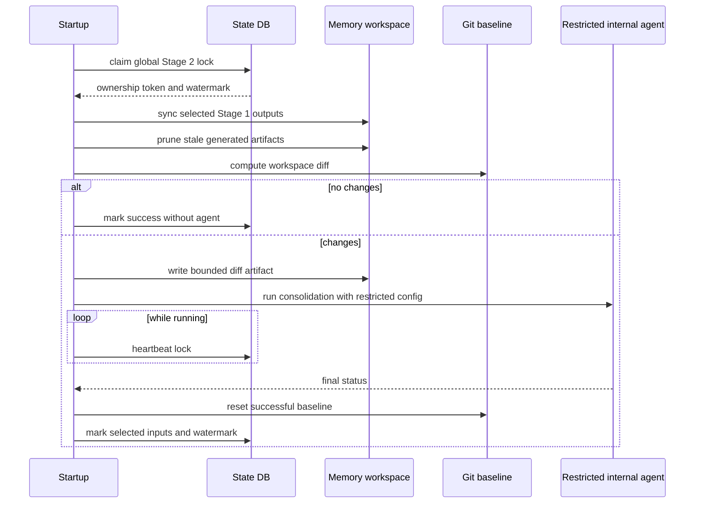

import MemorySideChannel from "../../../src/components/visual/MemorySideChannel.tsx";

# 第 22 章：Memories 与用户级状态

<MemorySideChannel lang="zh" client:visible />

第 21 章把 cloud tasks 和 local turn execution 分开：远程工作有自己的 task contract、identity layer 和 local apply boundary。Memories 采用同样的 架构纪律。长期上下文不是隐藏的 chat history。它是一个受控 side channel， 有 read path、write path、storage rules、locks、redaction，以及用于 consolidation 的受限 internal agent。

本章解释为什么需要这些额外机制。Memory system 可以让 Agent 在跨 session 时显得连续，但也可能泄漏陈旧事实、过度拟合旧对话，或者把敏感内容偷偷带进 未来 prompt。Codex 把 memory 当成显式子系统，是为了让 runtime 获得长期 context 的好处，同时仍然控制哪些内容能被读、被写、被引用。

## Memory 有独立 Read Path 和 Write Path

Read path 帮助当前 session 使用已有 memory。它在 summary file 存在时构建 developer-instruction context，解析 memory citations，分类 read usage，并 通过 read-only MCP filesystem service 暴露 list、read 和 search memory artifacts 的能力。

Write path 在 root-session startup 后台运行。它扫描符合条件的过去 rollouts， 提取结构化 memory records，把这些 records 存入 state database，把选中的 records 同步进 memory workspace，计算 workspace diff，再让受限 internal agent 合并这些 artifacts。



这个分离避免了一个常见错误：让当前模型直接改写自己未来会看到的 instructions。Codex 可以使用模型提取和合并 memory，但这些模型运行在有边界 的 pipeline 中，而不是运行在用户的普通 turn 内部。

## Read Path：有用，但只读

Read path 有两个职责。第一，它可以把有界 summary 注入当前 session 的 developer instructions，让模型在不扫描目录的情况下看到长期 context 的压缩 视图。第二，MCP memory service 让模型在需要更多证据时 list、read 和 search memory files。

MCP service 被刻意设计成 read-only 且 path-scoped。它拒绝 parent directory traversal、absolute paths、hidden components、symlinked files 和 symlinked ancestors。它会分页 list 和 search results，按 token budget 截断大文件读取， 并返回 relative paths。这些是普通 filesystem hardening 决策；在 memory system 中，它们还有第二个目的：防止“记忆”变成任意本地文件访问。

Search 也是结构化的。Request 可以匹配任意 query、要求所有 queries 在同一行， 或要求所有 queries 落在一个 line window 内。Response 包含 matching content、 line numbers、matched queries、pagination 和 truncation flag。这是 tool contract，不是终端 grep output。

## Citations 把 Memory 连回证据

Memory 需要 provenance。Codex 会把 citation blocks 解析成结构化 entries， 以及 rollout 或 thread ids。Citation 可以指向 memory artifact 位置，也可以 指向产生该 memory 的 rollouts。这让客户端和后续 runtime logic 能区分“模型 使用了 memory”和“模型提到了某个恰好被记住的事实”。

Citation system 刻意保持窄。它不试图证明每一句话。它给架构提供一个 hook， 把 memory usage 连回 source rollouts 和 memory files。这足以构建面向用户的 证据、usage metrics 和未来 pruning decisions，而不用把 memory 变成无边界的 provenance database。


可以把 citation 理解成一张紧凑收据：这段 memory artifact 来自哪些 rollout 或 thread source，并在 read path 中被使用。它不是模型权限，而是 runtime accounting。后续选择逻辑可以偏向最近被引用、确实有用的 memories；pruning 也能删除既不新鲜也不被使用的 artifacts。

## Stage 1 提取 Per-Rollout Memory

Stage 1 是并行且有界的。Startup 时，Codex 从 state database claim 符合条件 的 rollout jobs。Eligibility 由 session source、age、idle time、scan limits、 claim limits 和 lease ownership 决定。这可以避免 memory extraction 和 active sessions 竞争，也避免多个 concurrent startups 重复处理同一份工作。

每个被 claim 的 rollout 会被过滤成 memory-relevant response items。模型被 要求输出结构化结果：详细 raw memory、紧凑 summary，以及可选 slug。Codex 验证输出 shape，对生成字段做 secrets redaction，然后把成功结果写回 state database。空但有效的输出会和失败分开标记；失败会进入 retry backoff，而不是 热循环重试。

```text
// Pseudocode - illustrative pattern.
procedure stage_one_startup():
    claims = reserve_pending_summaries(
        allowed_sources,
        age_window,
        idle_window,
        scan_limit,
        claim_limit,
        lease_seconds
    )

    run_in_parallel(claims, concurrency_limit):
        items = load_rollout_items(claim.rollout)
        filtered = keep_memory_relevant_items(items)
        output = model_extract_structured_memory(filtered)

        if output is invalid:
            mark_failed_with_retry(claim)
        else if output has no useful memory:
            mark_succeeded_no_output(claim)
        else:
            safe_output = redact_secrets(output)
            store_stage_one_output(claim, safe_output)
```

这里使用模型，是因为 memory extraction 是语义任务。围绕模型的确定性护栏同样 重要：claim leases、schema shape、redaction、有界并发、retry accounting 和 database persistence。

## Stage 2 合并全局 Memory

Stage 2 是串行的。它先 claim 一个 global lock，然后才触碰 memory workspace。 接着它准备 git-baseline workspace，为 internal agent 构造 locked-down configuration，加载被选中的 Stage 1 outputs，同步 raw memory artifacts 和 rollout summaries，清理 stale generated resources，并让 git 判断 workspace 是否变化。

如果没有 diff，Stage 2 可以不运行模型，直接标记成功。如果存在 diff，它会 写入有界 workspace-diff artifact，spawn internal consolidation agent，在 agent 运行期间 heartbeat global lease，并且只在成功完成后 reset workspace baseline。



Git baseline 不是为了协同开发。它是 memory workspace 的确定性 diff engine。 Stage 2 用 diff 判断是否需要 consolidation，并给 internal agent 一个有界的 changed artifacts 视图。

## Internal Agent 被刻意限制

Stage 2 使用 model-guided agent，是因为 consolidation 是编辑工作：合并相关 memories，更新 summaries，维护更高层 memory artifacts。但这个 agent 不是 普通用户 session。

它的配置被约束：

- 在 memory workspace 中运行；
- 是 ephemeral，不会把自己反馈进 memory generation；
- 对这个 agent 禁用 memory use 和 memory generation；
- 禁用 apps、plugins、MCP servers 和递归 collaboration features；
- approval 策略设置为不会等待用户决策；
- filesystem write access 只允许 memory root；
- 禁用 network access。

这就是 memory system 的核心安全模式。Codex 允许模型执行语义部分，但移除 ambient authority。Internal agent 可以编辑 memory artifacts；它不能浏览网络、 调用任意工具、继续委派更多 agents，或制造另一个 memory loop。

## Memory Selection 受 Usage 影响

Stage 2 不会永远合并所有 Stage 1 output。它选择一个有界集合。Outputs 可以 因为长期未使用而老化退出。已有 usage 的条目会按 usage count 和 recency 排序； 没有 usage 的条目可以回退到 generation time，这样 fresh memories 不会仅仅 因为尚未被引用就被忽略。

Selection 会影响 workspace。Raw memories 用稳定顺序渲染，以避免 churn。 Rollout summary files 镜像 selected set。Stale summaries 和旧 extension resources 会被清理，让 deletions 出现在 workspace diff 中。成功 consolidation 会标记精确消费过的 Stage 1 snapshots。

这种设计把 memory 当作有 lifecycle 的 state，而不是 append-only lore。永远 未被使用的 memory 可以从 active set 中消失；经常被使用的 memory 可以继续 保留。系统保留足够 accounting，在模型之外做这个决定。

## 失败模式

Memory failures 如果静默发生会很危险。因此 Codex 在 startup integration 上 选择 fail-soft，但在 pipeline 内部做显式 accounting。如果 session 是 ephemeral、memory 被禁用、session 是 sub-agent，或 state database 不可用， startup generation 会被跳过。如果 backend rate limits 太低，generation 会 被跳过，而不是消耗稀缺 tokens。如果 Stage 1 extraction 失败，job 会标记为 failed 并进入 retry backoff。如果 Stage 2 无法持有 global lock，它不会修改 workspace。

Read path 也会 fail closed。Invalid paths、hidden paths、symlinks、invalid cursors、invalid line offsets、empty queries 和 non-file reads 都会变成 tool errors。模型可能得到更少 memory context，但不应该获得不受控的 filesystem access。

最重要的失败边界是 feedback。一个会总结自己 consolidation sessions 的 memory system 会放大错误。Codex 通过跳过 sub-agent sessions、把 consolidation agent 标成 ephemeral，并在该 agent 内禁用 memory features 来 避免这一点。

## 应用到实践

1. **Memory as side channel。** 解决隐藏长期上下文问题；让 memory 显式、
   可检查、可单独关闭；风险是通过 chat history 偷塞永久指令。
2. **读写分离。** 解决自修改上下文问题；允许 active session 读 memory，
   但写入走独立 pipeline；风险是让一个 turn 直接改写自己的未来 prompt。
3. **模型抽取护栏。** 解决摘要噪声问题；用 claims、schemas、redaction、
   leases、retries 包住 extraction；风险是因为模型输出写得好就相信它。
4. **串行 consolidation。** 解决 memory writer 竞争问题；用 global lock 和
   workspace diff 做持久更新；风险是乐观合并并发 memory edit。
5. **最小权限 internal agent。** 解决递归放大错误问题；consolidation agent
   禁用 memory 并限制权限；风险是让 summarizer 从自己的 summary 学习。

## 收束

Memories 完成了第六部的主题。Multi-agent work 需要 interaction edges； cloud work 需要 task contracts 和 signed identity；长期 context 需要受控的 read/write channels。三个场景里，Codex 都拒绝把 state 隐藏在自然语言里。 可靠架构来自命名 state、记录边界，并让模型在这些边界内工作。

<div class="source-equivalence">

## 源码地图

| 概念 | 源码锚点 |
| --- | --- |
| Memory usage kinds | [`codex-rs/memories/read/src/usage.rs`](https://github.com/openai/codex/blob/569ff6a1c400bd514ff79f5f1050a684dc3afde3/codex-rs/memories/read/src/usage.rs#L8) |
| Citation parser | [`codex-rs/memories/read/src/citations.rs`](https://github.com/openai/codex/blob/569ff6a1c400bd514ff79f5f1050a684dc3afde3/codex-rs/memories/read/src/citations.rs#L1) |
| Read-only MCP memory service | [`codex-rs/memories/mcp/src`](https://github.com/openai/codex/tree/569ff6a1c400bd514ff79f5f1050a684dc3afde3/codex-rs/memories/mcp/src) |
| Stage 1 extraction | [`codex-rs/memories/write/src/phase1.rs`](https://github.com/openai/codex/blob/569ff6a1c400bd514ff79f5f1050a684dc3afde3/codex-rs/memories/write/src/phase1.rs#L1) |
| Stage 2 consolidation | [`codex-rs/memories/write/src/phase2.rs`](https://github.com/openai/codex/blob/569ff6a1c400bd514ff79f5f1050a684dc3afde3/codex-rs/memories/write/src/phase2.rs#L1) |

</div>
